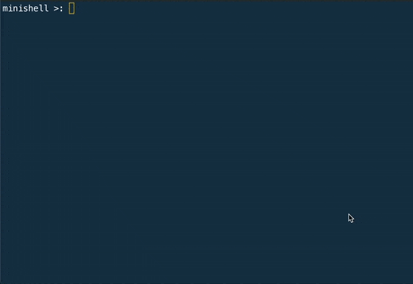

Minishell

Simplified shell that mimics bash behaviour and it can be used with same commands as bash.



Functionalities included:
- redirections
- pipes
- environment variables

Built-in functions:
- env
- unset
- export
- cds
- echo with -n flag
- pwd
- exit

This was a Hive Helsinki group project that I did with [Tomi Kartaslammi](www.github.com/tkartasl)

## Install & Run

```
git clone git@github.com:svolain/minishell.git
cd minishell
make
./minishell
```

For exiting the shell you can use "exit"-command
